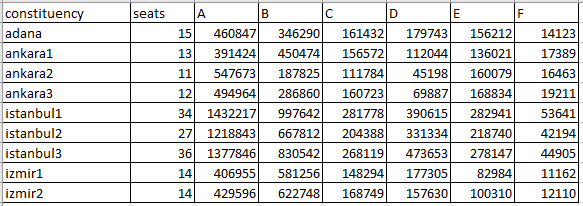
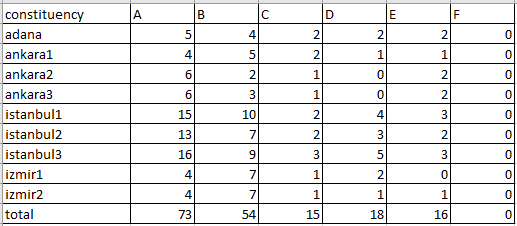

# PyHondt
Simple Python script that calculates the number of seats according to the D'Hondt method.

<br>

## Prerequisites
   - Python2 / Python3

You don't need to do anything with csv module since it is included in the Python installation.

<br>

## Usage
1. Fill the columns after the "seats" column with the name of all parties.
2. If seats are reserved for constituencies, write the names of constituencies to the first column of each row and number of seats to the second column of each row. Otherwise, you can handle all the results in one constituency and name it "x".
3. If a party did not nominate a candidate in a constituency or did not receive votes, write 0 there. (Do not leave it blank!)
4. Run the `main.py` file.

   ```sh
   python main.py
   ```
   
<br>

## Input / Output

### Sample Input


### Sample Output

   
<br>

## Special notes on Turkish election system:
  - sample_input.csv dosyasındaki bölgeler ve koltuk sayıları Mart 2021 tarihli YSK kararından alınmıştır. Zaman içerisinde nüfus değişimine göre değişiklik gösterebilir.
